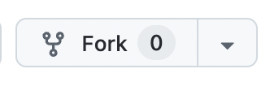
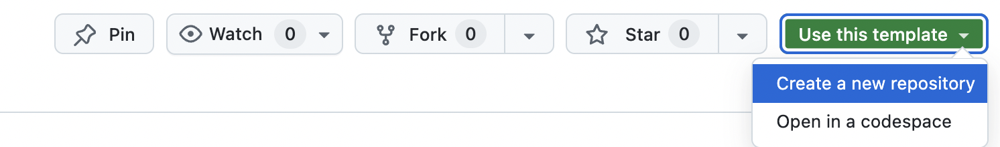

# React Vorlage für Modul 3050 WID

- "template repository" mit Startercode für _React_ **SPA** (_Single Page App_) Projekte
- basiert auf [_Vite+React+JS_](https://vite.dev/guide/) Vorlage
- die ursprüngliche Vorlage wurde auf das Minimum reduziert

## Verwendung

### 1.Forken

- dieses Repo forken (eine Kopie wird in dem persönlichem GitHub Konto angelegt)



### 2. Neues Repository erstellen

- für neuen Projekte einfach die "Use this template" Funktion von GitHub verwenden:
  

### 3. Installieren

1. Neues Projekt Repository in ein gewünschtes lokate Verzeichnis klonen:

```sh
git clone <repo-url>
```

2. In der Projektordner wechseln:

```sh
cd <repo-name>
```

3. `npm` Abhängigkeiten installieren:

```sh
npm install
```

4. dev-Server starten:

```sh
npm run dev
```
